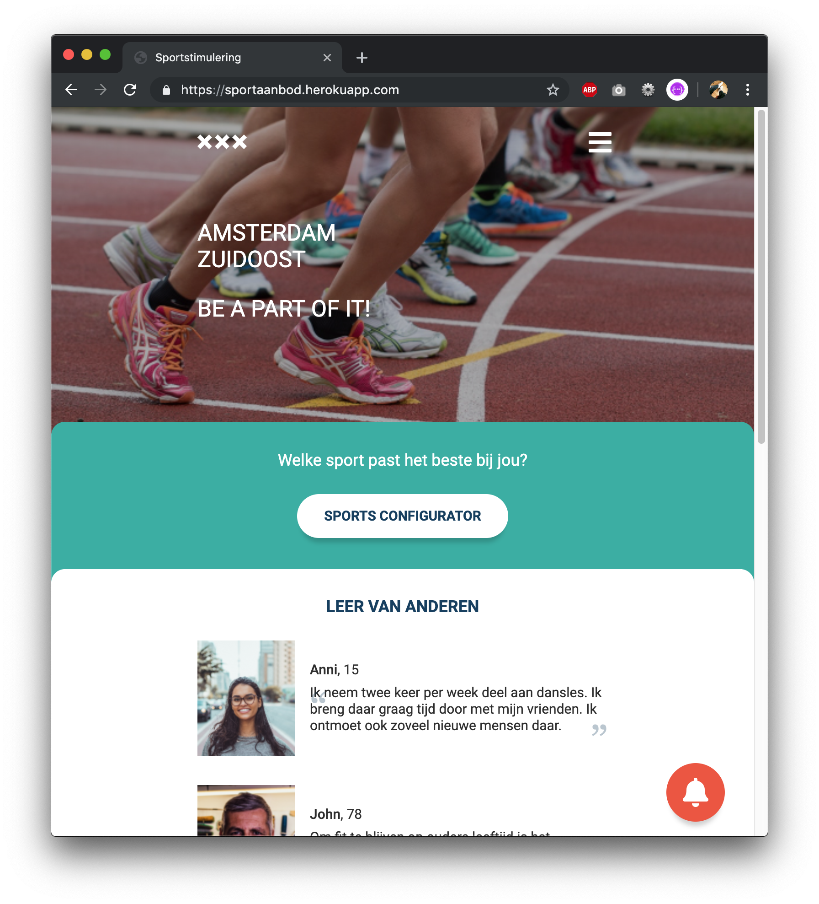
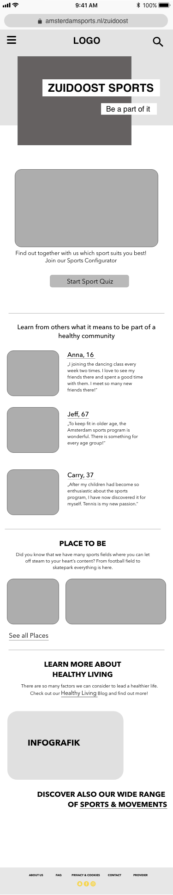
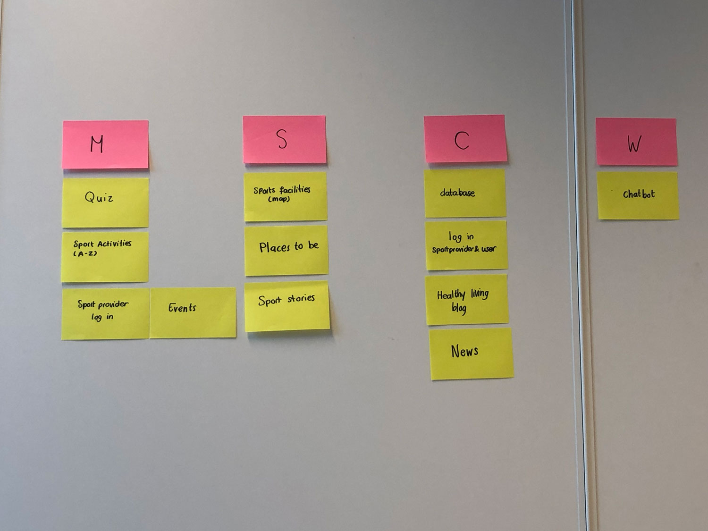
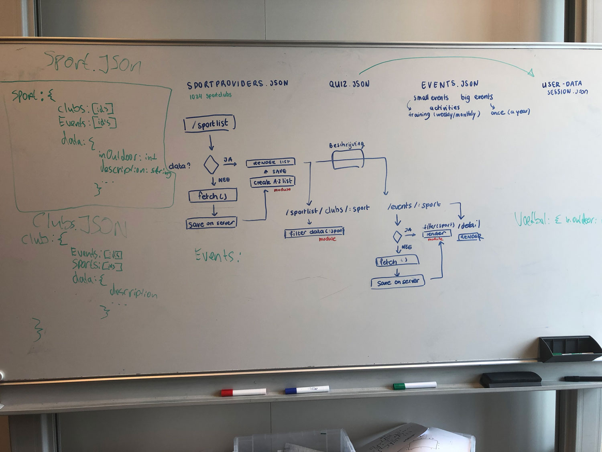
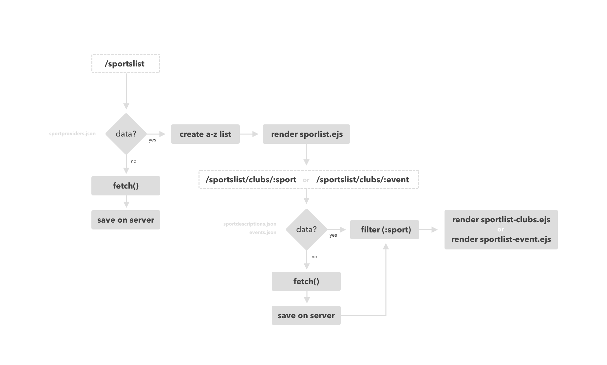
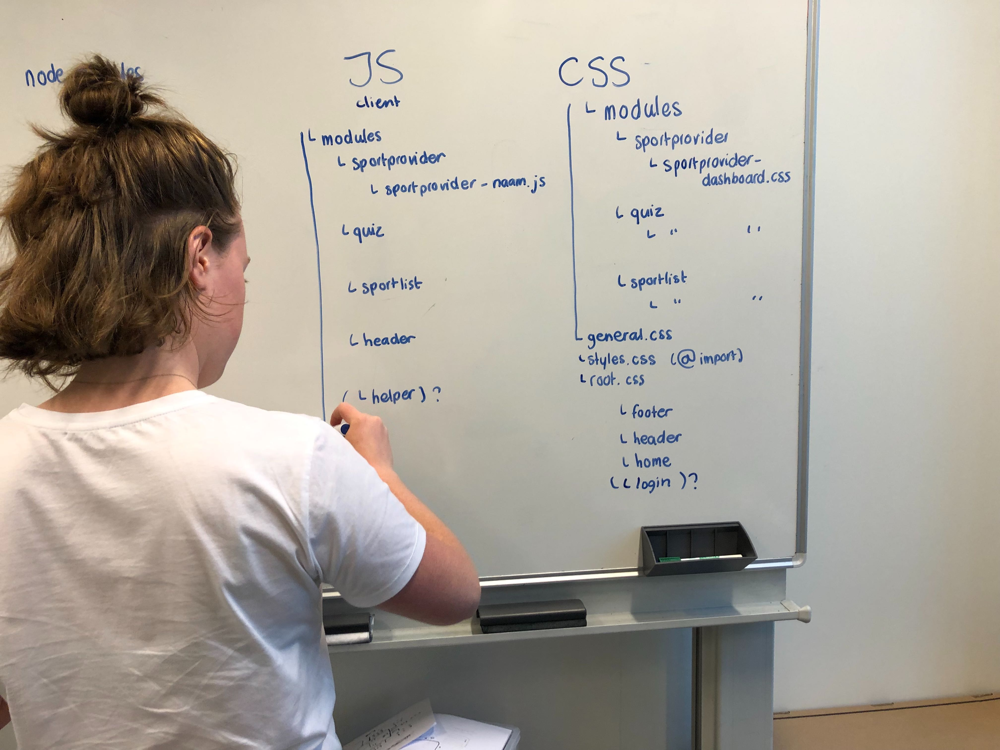
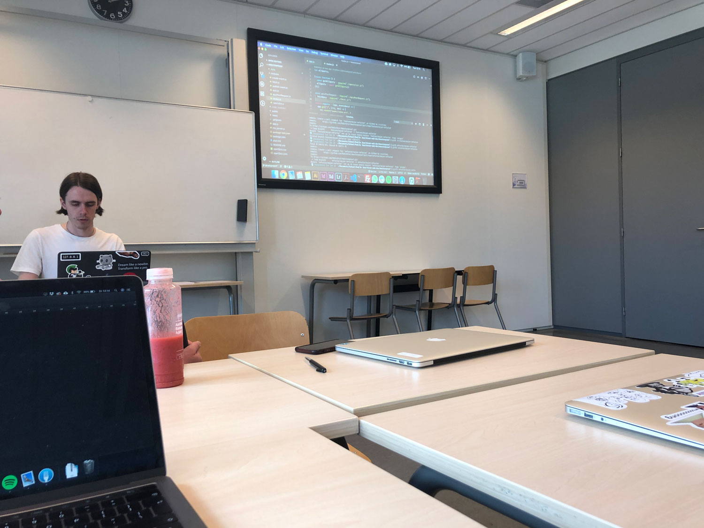

**🎓Meesterproef 2019 @cmda-minor-web · 2018-2019** 

During the Meesterproef I worked on a project for Gemeente Amsterdam.



## Brief

During the brief we met the people who work for the sport promotion in Amsterdam Zuidoost. They told them their desires and the problems sportproviders, sportclubs and sports brokers deal with in Zuidoost.

#### The problem

There are many sport providers in Zuidoost (around 180), but the participation of the inhabitants (around 900.000) in sport activities there is the lowest in whole Amsterdam. Providers often have difficulty in spotlighting their offer and potential users may have problems to find what they are looking for.

#### The question

Gemeente Amsterdam had the desire to have an app that contains all the sportofferings of Amsterdam Zuidoost. The user should quickly get an overview of where specific sports activities are taking place. What other information is relevant for the user had to be researched.  


#### The team

During this project I worked together with three other Web-Developers: Bas Pieren, Robin Stut en Jesse Dijkman. During the first weeks we also worked together with four User Experience students. During the first meeting they presented their first insights and ideas based on the research they already did.


## Research 

The User Experience Designers worked out a concept and wireframes based on research they did. 

#### Insights

During interviews and field research the UX people gathered the following insights:

1. Users don’t know about the sports offerings in their area.
2. A missing overview of sport offerings in Zuidoost makes finding new activities hard for users.
3. Users are not motivated to start looking online for new sport activities (time & money keeps motivation low).
4. Users are unsure about what kind of sports activity they would like to do and therefore need inspiration.
5. Users hear from sport activities from their network rather than from online platforms.
6. The vibes / people of a sports activity are very important. The community aspect is very important.

From an interview with a sport provider: 
> __*"Stressing the community aspect is the key. (...) All those people go to church every day. They already live the community, but in a different sector (...) The club culture is not really there yet."*__


## The goals 

Based on the research, these are the goals we want to reach:

- Improve reputation of sports offerings in Zuidoost 
- Increase sport activity of the inhabitants of Zuidoost.
- Increase sport participation index of Zuidoost and bring it at least to the ave rage of whole Amsterdam.
- Provide an overview platform of all sport activities in Zuidoost.
- Make the communication between sport providers and inhabitants more efficient.
- Get more members/participants in sport clubs/events.

The main goal is to: "Increase sport activity of the inhabitants of Zuidoost."

## The concept

Based on these insights and goals the UX designers came up with the following concept:

A platform that:
- "Feels like a community a user wants to belong to" 
- "Inspires and motivates the user to find a sports activity that fits."

The website focusses on the 3 pillars 

- **Providing information**
Users can read about sport events, sport clubs and sport locations
    - A-Z list
    - Map
- **Self actualization** 
Users have their own space, where they have their own profile:
    - Where they can track their activity
    - Save sport challenges
    - Create competitions
 - **Community** 
Involve people by creating a digital network by:
    - Share-functions
    - Social Media integration
    - Push-messages
    - Reviews

#### Wireframes




The homepage contains: 
- A call-to-action to start the sportquiz to find out which sports the user the best. 
- A section with personal stories that can inspire people to also start sporting.
- A section where inhabitants of Zuidoost can discover all (free) sporting places.
- A section where inhabitants of Zuidoost can find information about other factors to live a healthier life.

The rest of the website contains:

- Sports Activities List (A-Z) & map
- Events page
- News page
- Healthy Living Blog


## Testing & meeting with client

During this week we made an setup for an Git/GitHub environment. Read more about that here. We also tested the wireframes the UX designers made. 

That week we showed Vincent, an sport broker in Zuidoost, the wireframes and told them about the concept. He was very happy to see the A-Z list. He told us that often mothers of children come to him to ask where their children can play sports. Due to a lack of an overview and sometimes also because these people cannot read or write (dutch), it's difficult for him to help. With this list, he could help them.

When we showed Vincent the wireframes about personal accounts, he told us that we have to be very careful with that because of the new privacy law. 

### Adjusting the concept 

After the tests and meeting it was clear that the concept needed some adjustments. But not all the UX designers wanted to adjust the concept. As a result, they each went their own way. Because of this and because we realized that we had to set priorities because the concept was big to finish within 5 weeks, we made some priorities using the MoSCoW method.



The main features we focus on from now on are: 

- A Quiz/Configurator: where an user can find out what kind of sport suits him the best by filling in some personal questions. After completing the quiz, the user will see an overview of which sports would suit the user best. The user can view a list of associated clubs for each sport.

- A list with all sport activities in Amsterdam: so a user and/or sport broker can see in a simple overview what kind of sports are available in Amsterdam (Zuidoost). In the form of a list and a map.

- An environment for sport providers: so sports providers can create an event and add it to an overview.

Other features are cool but are not very necessary to show what the concept is like. 

Now that it became clear which way we were heading and since we had no design yet, I started designing the home page.

<!-- Afbeelding design -->


<!-- I worked out most of the sports list functionalities. You can read more about that here. -->


## Adjusting again

During a conversation with Koop about the project, we discovered that it was better to focus on sports events than sports clubs. After all, we want people to start exercising. But they probably won't start if we (only) show them an list of sport clubs. We better show a list of events they can join more easily, so that they can try out first before deciding if they want to join a club.

During a new meeting with the client (and Vincent) we presented our "new" concept. 

From the feedback we have adjusted the following:
- Change the word events to activities. It was not clear that events could also include trial lessons. 
- Show not only sport activities but also sport clubs.

I got the feeling that the client was a little bit sceptical about all this. Maybe because the UX designers also showed their Marvel prototypes which had some nice transitions and it probably looked like a more already finished product. 

To ensure that the client will also be more enthousiast about our project, we added some small things that made our website more fancier. 

## Endresult


## Personal learning goals

| Criteria 	| Description 	| Use within project 	|
|---------------------------------------------------------------------------------------------------------------------------------------------------------------------------------------------	|------------------------------------------------------------------------------------------------------------------------------------------------------------------------------	|----------------------------------------------------------------------------------------------------------------------------------------------------------------------------------------------	|
| You can understand the core functionality of a use case. (Browser Tech) 	| The student has well understood the core functionality of a use case and has acted accordingly. 	| The assignment / concept is too big to "finish" in 5 weeks. It is important to make choices here. 	|
| You can retrieve data, manipulate it and dynamically convert it to html elements by using. templating. You understand how you can work with an external API using asynchronous code. (WAFS) 	| (Different) smart methods are used to manipulate and manage JSON data. 	| Different databases are used to provide users with an overview of all sports activities, sports clubs and activities. 	|
| You can add structure to your code by applying patterns. You can argue the choice for the chosen patterns (WAFS) 	| Minimal use was made of an IIFE and Object Literals to introduce structure, in the form of modules, to the code and to prevent unnecessary contamination of the global scope 	| Because we work on the same project in a team of four, it is important to make agreements about code styles. With all the different functionalities, it is also useful to work with modules. 	|
| You know the difference between client side and server side rendering and you can use server side rendering to display data from an API. (PM) 	| The application can at least display an overview page and detail page without having JS turned on in the browser. 	| Since you never know who turned of javascript and because it improves the performance for the users. 	|

### Core functionality

The concept the UX designers first presented was quite a complex and big concept. From the beginning my team and I knew that we couldn't build this in 5 weeks. That's why we used the MoSCoW method to prioritize the functionalities. 

While creating the A-Z list, I also had to set priorities. I asked myself the following questions: 
- It is very important that the user can also sort the list differently?
- Is it important that the user can search this list of sports with a search bar?

NO. So I focused on the most important thing: Show all the sports you can do in Amsterdam and the corresponding sports clubs and activities.

<!-- During every meeting with the client, the client introduced us to new people who also worked in Zuidoost for the "sports world". These people all had new insights and whishes for the website. -->


### Retrieve and manipulate and manage data 

Within the website we use different databases to provide users with an overview of all sports activities and sports clubs.

To prevent the data from having to be fetched again every time the page is refreshed I save the data on the server after it was loaded for the first time. To get an overview I created an diagram together with my teammates. 


Digital version:


To store the data I created variables on the server: 

```js
let data = []
```

When fetching the data I check if there already is data in the variable. 

```js
if (data.length === 0) {
    const response = await fetch(url)
    const data = await response.json()
    resolve(data)
}
```
If not > fetch the data and resolve
```js
    else {
    resolve(data)
}
```
Else resolve the already existing data

It would of course be more ideal to store this data in a database, but it is a prototype. A database was not important for this prototype.

When something changes in the data, I can never show this. Since I now get the data from the variable instead of the direct source. Jesse wrote something for this.

```js
let _eventData, _clubsData, _descriptionData, _quizData

async function updateData() {
	_eventData = await fetch.file("data/json/sportEvents.json")
	_eventData = JSON.parse(_eventData)

	_clubsData = await fetch.file("data/json/sportaanbieders.json")
	_clubsData = JSON.parse(_clubsData)

	_descriptionData = await fetch.file("data/json/sportDescription.json")
	_descriptionData = JSON.parse(_descriptionData)

	_quizData = await fetch.file("data/json/sportQuizFilter.json")
	_quizData = JSON.parse(_quizData)
}

updateData()

setInterval(updateData, 1000 * 60 * 60 * 24)
```

This is making sure the data will be checked every day. 

To manipulate the data I used `.filter`, `.map` and `.reduce`. 

```js
const allSportClubs = dataMapping.filter(item => Object.keys(item).length !== 0) 
// remove all empty records

const allSports = allSportClubs.map(item => item.sport)
const uniqueSports = [...new Set(allSports)].sort()
// create an array with all unique sports

// create an array that sorts every sport with the same first letter in the same key entry 
const sortedSports = uniqueSports.reduce((a, sport) => {
    if (sport !== undefined) {
        let firstLetter = sport[0].toLocaleUpperCase()
        // either push to an existing key entry or create one
        if (a[firstLetter]) {
            a[firstLetter].push(sport)
        } else {
            a[firstLetter] = [sport]
        }
        return a
    }
}, [])

```

## Structure 
You can add structure to your code by applying patterns. You can argue the choice for the chosen patterns (WAFS)

Because we all worked on different features, we started working in modules. It helped not only getting structure but also when merging different branches, there probably will be less merge conflicts.

Read about: how we worked together as a team and created structure.


### Samenwerking met Web Dev


- files opnieuw ordenen
- data management samenkomt

Working in modules
File structure 

#### git & github
When it comes to git and Github I learned a lot! I never worked in a same repository with other developers before. So Bas created an Branch structure: 
```
master: The main branch. Everything thats on here works 100%.
|
|- development: The branch that we are working on. Development should be merged every week with master.
|  |
|  |- feature/name: The branch you create to work on a feature. Before you create a new feature you must pull from development.
|
```
Then accidentally I deleted the development branch 😱😱😱. Luckily we all had a local copy. So after that we activated branch protection. Now we had to create an pull request before merging with the master.

#### Folder structure
After a few weeks, the overview in the different folders became a bit lost. At that point we sat down to discuss how to re-organize the folder structure. 



```
root
|
|- data/
|  |
|  |- json/
|  |- raw/
|
|- modules/
|
|- public/
|  |
|  |- css/
|  |  |
|  |  |- modules/
|  |  |- styles.css
|  |
|  |- images/
|  |
|  |- js/
|     |- modules
|     |- script.js
|
|- views/
|  |
|  |- pages/
|  |  |- index.ejs
|  |- partials/
|
|- app.js
|
```
## Code
We also went to sit down and discuss our code. 

- Dubble `"` instead of single `'`.
- No `;` at the end.
- Multiple variables would each have `const` or `let` written in front of them. No `,` seperation.



This also saved a lot of confusion during merge conflicts. In a next project I want to do this type of discussion at the start of a project. It takes a lot less time then it did now. 
